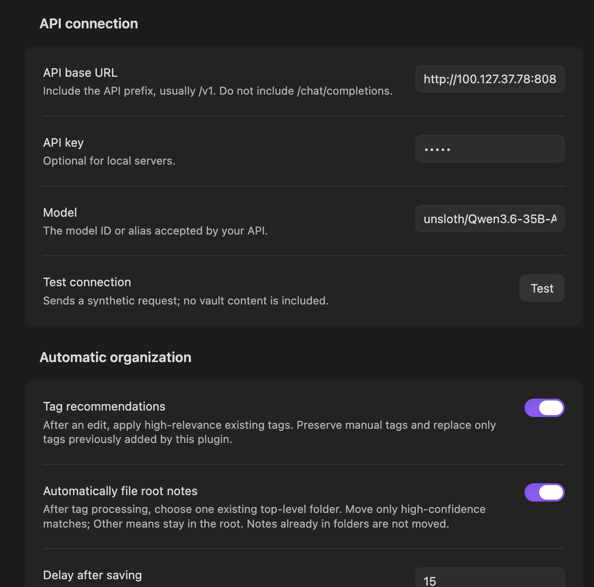

# Tagged

Tagged is an Obsidian plugin that organizes notes with your existing tags and an OpenAI-compatible LLM. It preserves manual tags and updates only tags it previously added.

Prefer a local LLM for private notes: note content is sent to your configured API. Tagged has no telemetry.

## Settings preview

## Usage

Configure your API URL, model, and optional API key in settings, then use **Test connection**.

Run either command from the command palette:

- **Tagged: Organize current note** — organize the active note.
- **Tagged: Reorganize all notes** — organize all notes using your enabled options.

Key options:

- **Tag recommendations** — recommend existing tags; optionally limit this to notes without tags.
- **Keep refresh** — automatically organize 15 seconds after the last save. Off by default.
- **Automatically file root notes** — move root notes into existing top-level folders when confidence is high. Off by default. Daily notes are skipped by default; tags and filename patterns can also be excluded.
- **Organize root assets** — optionally move root images into `Assets` or a custom folder when root filing is enabled.
- **LLM prompts** — edit tag and directory prompts or restore their defaults.
